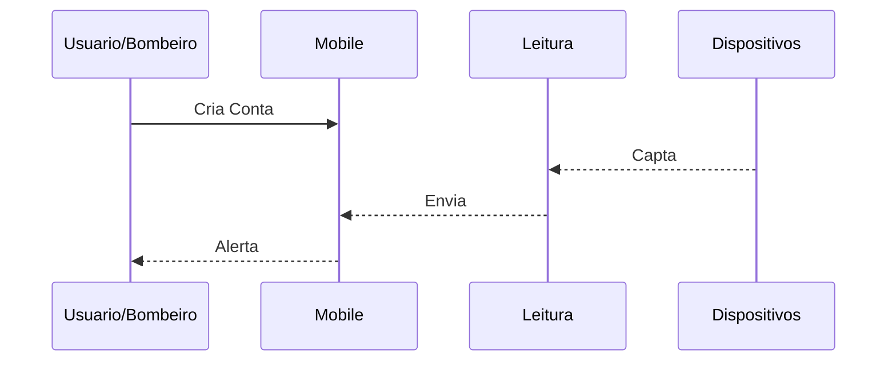

## 🌡️ SafeZone - API REST em .NET  
Este projeto é uma Web API desenvolvida em ASP.NET Core, que permite o controle de dispositivos IoT e alertas ambientais com operações básicas de CRUD (Create, Read, Update, Delete). A aplicação segue uma arquitetura em camadas, com separação de responsabilidades entre Model, Business, Data e API.

---

## 🌍 Nome do Projeto: SafeZone  
O projeto SafeZone nasceu da necessidade de monitorar ambientes sensíveis a mudanças climáticas e variações extremas de temperatura e umidade. Ambientes como garagens, espaços industriais ou locais que abrigam populações vulneráveis precisam de uma solução confiável e em tempo real para detectar riscos.

O sistema utiliza sensores conectados a dispositivos IoT, que coletam informações ambientais e as transmitem para uma Web API. Essa API organiza os dados e emite **alertas automáticos** caso os valores ultrapassem os limites seguros.

A interface web, feita com Razor Pages, permite que os usuários visualizem os alertas, dispositivos instalados e os dados de leitura em tempo real. Tudo isso proporciona mais segurança, controle e agilidade na tomada de decisões.

---

## 🔗 Rotas  
🔹 UsuarioController  

| Método | Endpoint               | Descrição                |
|--------|------------------------|--------------------------|
| GET    | /api/usuario           | Lista todos os usuários  |
| GET    | /api/usuario/{id}      | Retorna usuário por ID   |
| POST   | /api/usuario           | Cria um novo usuário     |
| PUT    | /api/usuario/{id}      | Atualiza um usuário      |
| DELETE | /api/usuario/{id}      | Remove um usuário        |

🔹 DispositivoController  

| Método | Endpoint                   | Descrição                     |
|--------|----------------------------|-------------------------------|
| GET    | /api/dispositivo           | Lista todos os dispositivos   |
| GET    | /api/dispositivo/{id}      | Retorna dispositivo por ID    |
| POST   | /api/dispositivo           | Cria um novo dispositivo      |
| PUT    | /api/dispositivo/{id}      | Atualiza um dispositivo       |
| DELETE | /api/dispositivo/{id}      | Remove um dispositivo         |

🔹 LeituraController  

| Método | Endpoint              | Descrição                    |
|--------|-----------------------|------------------------------|
| GET    | /api/leitura          | Lista todas as leituras      |
| GET    | /api/leitura/{id}     | Retorna leitura por ID       |
| POST   | /api/leitura          | Registra uma nova leitura    |
| PUT    | /api/leitura/{id}     | Atualiza uma leitura         |
| DELETE | /api/leitura/{id}     | Remove uma leitura           |

🔹 AlertaController  

| Método | Endpoint             | Descrição                   |
|--------|----------------------|-----------------------------|
| GET    | /api/alerta          | Lista todos os alertas      |
| GET    | /api/alerta/{id}     | Retorna alerta por ID       |
| POST   | /api/alerta          | Cria um novo alerta         |
| PUT    | /api/alerta/{id}     | Atualiza um alerta          |
| DELETE | /api/alerta/{id}     | Remove um alerta            |

---

## 🚀 Tecnologias Utilizadas  
- .NET 8  
- ASP.NET Core Web API  
- Entity Framework Core  
- Oracle  
- Razor Pages  
- Swagger (Swashbuckle)  
- Visual Studio 2022+  
- REST Client (ou Postman)  

---

## 💻 Como Rodar  
1. Git clone https://github.com/NicolasGCADS/Global-Solution.git
2. Selecione a pasta SafeZoneApi e selecione SafeZoneApi.sln para compilar o projeto completo
3. Ao rodar o Crud, rode com HTTPS 
4. Ao rodar o Crud com Swagger, rode com esse link https://localhost:7268/swagger/index.html
5. Ao rodar o Razor, rode com esse link https://localhost:7160

---

## 💻Testes para Rodar 


## 📦 Endpoints da API - SafeZone

### 👤 Usuário

#### 🔵 POST - Cadastrar novo usuário
`POST /api/usuario`
```json
{
  "email": "robertolima@gmail.com",
  "senha": "Roberto123",
  "role": "ADMIN"
}
```

#### 🟢 GET - Listar usuários
`GET /api/usuario`

#### 🟡 GET - Detalhes de um usuário
`GET /api/usuario/{id}`

#### 🟠 PUT - Atualizar usuário
`PUT /api/usuario/{id}`
```json
{
  "email": "julicesar@gmail.com",
  "senha": "Julio123",
  "role": "ADMIN"
}
```

#### 🔴 DELETE - Remover usuário
`DELETE /api/usuario/{id}`

---

### 🌡️ Leitura

#### 🔵 POST - Nova leitura
`POST /api/leitura`
```json
{
  "dataHora": "2025-06-08T12:00:00",
  "temperatura": 31.5,
  "umidade": 65.2
}
```

#### 🟢 GET - Listar leituras
`GET /api/leitura`

#### 🟡 GET - Detalhes da leitura
`GET /api/leitura/{id}`

#### 🟠 PUT - Atualizar leitura
`PUT /api/leitura/{id}`
```json
{
  "dataHora": "2025-06-08T15:00:00",
  "temperatura": 30.1,
  "umidade": 60.0
}
```

#### 🔴 DELETE - Remover leitura
`DELETE /api/leitura/{id}`

---

### 📍 Dispositivo

#### 🔵 POST - Cadastrar dispositivo
`POST /api/dispositivo`
```json
{
  "latitude": -23.5505,
  "longitude": -46.6333,
  "descricao_Local": "Garagem Principal",
  "ativo": 1
}
```

#### 🟢 GET - Listar dispositivos
`GET /api/dispositivo`

#### 🟡 GET - Detalhes do dispositivo
`GET /api/dispositivo/{id}`

#### 🟠 PUT - Atualizar dispositivo
`PUT /api/dispositivo/{id}`
```json
{
  "latitude": -23.5560,
  "longitude": -46.6400,
  "descricao_Local": "Garagem Secundária",
  "ativo": 0
}
```

#### 🔴 DELETE - Remover dispositivo
`DELETE /api/dispositivo/{id}`

---

### 🚨 Alerta

#### 🔵 POST - Criar alerta
`POST /api/alerta`
```json
{
  "tipo": "FUMAÇA",
  "descricao": "Sensor detectou fumaça na garagem A",
  "dataHora": "2025-06-08T14:45:00"
}
```

#### 🟢 GET - Listar alertas
`GET /api/alerta`

#### 🟡 GET - Detalhes do alerta
`GET /api/alerta/{id}`

#### 🟠 PUT - Atualizar alerta
`PUT /api/alerta/{id}`
```json
{
  "tipo": "CALOR",
  "descricao": "Temperatura crítica detectada na garagem B",
  "dataHora": "2025-06-08T15:20:00"
}
```

#### 🔴 DELETE - Remover alerta
`DELETE /api/alerta/{id}`


## Diagrama 


---

## Configure a string de conexão Oracle no appsettings.json:
json

"ConnectionStrings": {
  "DefaultConnection": "User Id=usuario;Password=senha;Data Source=oracle_connection_string"
}


---

## 🧑‍💻 Integrantes do Grupo

Guilherme Romanholi Santos - RM557462

Murilo Capristo - RM556794

Nicolas Guinante Cavalcanti - RM557844

---

## Videos

Video demostrativo de C# https://youtu.be/KYQzSGXQH9s

Video Pitch https://youtu.be/kOYEASWNoU4
